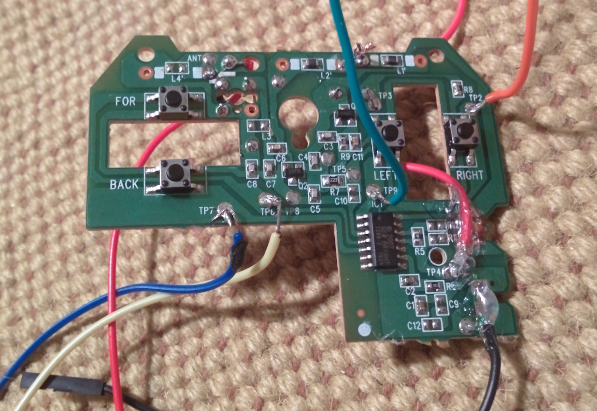

# Driving With Elixir

I had a raspberry pi sitting around and wanted to make something move.
[Blinking LEDs](https://github.com/mmmries/pi-alarm-clock) are fun, but I wanted to see something move.
I failed to find a cheap (less than $20) robotics kit online and just then I nearly tripped over an old RC truck we had bought for my son.

## Investigation

I opened up the guts of the truck itself, but couldn't easily make heads or tails of where I would wire up my pi.
So I took apart the transmitter and found something that looked pretty obvious.
There were push buttons labeled "For", "Back", "Left" and "Right".
I could also easily see the connections printed on the board for these buttons and there were some solder points right there on the board.
This looked like a good place to start.

## Wiring

The transmitter was using 2-AA batteries which lines up well with the Raspberry Pi's 3.3V power level.
So I started by snipping the wires connecting the batteries to the transmitter board and soldered on some leads like this:

When I was snipping the wires I accidentally broke the whole 3.3V terminal off the board.
DANG!
As a result I had to solder my lead straight to a trace on the board which makes for a very fragile connection.
To avoid losing this connection I put some hot glue on the wire to keep it stationary and avoid breaking the solder.
I also had to make an extra connection to the top of the board since it had been connected to the old 3.3V terminal that I broke.

> Lesson Learned: don't try to bend things on pre-manufactured electrical boards.

Once that was done I soldered some leads to the traces that hooked up to the push buttons for the "For", "Back", "Left", and "Right" buttons.

This left the overall transmitter board looking like this:

